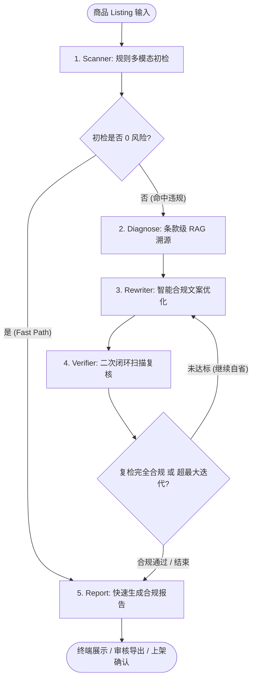

# ListingGuard: 工业级电商商品上架合规运营 Agent

<p align="center">
  
  
  
  
  
</p>

> **面向淘宝、拼多多与 eBay 跨境电商的智能上架风控治理与自省文案优化智能体**。
> 突破传统正则拦截工具“只堵不通”的局限，构建“扫描检测 -> 条款级 RAG 诊断溯源 -> 智能文案改写 -> 二次闭环复检 -> 人机协作与审计归档”的完整自省工作流。

---

## 目录
- [业务背景与痛点](#业务背景与痛点)
- [核心架构与自省闭环](#核心架构与自省闭环)
- [支持平台与合规策略矩阵](#支持平台与合规策略矩阵)
- [政策检索 (RAG) 与敏感词风控 (Hook) 的职能分工](#政策检索-rag-与敏感词风控-hook-的职能分工)
- [商品与营销帖子数据库 (RBAC 与管理员二次确认)](#商品与营销帖子数据库-rbac-与管理员二次确认)
- [多模块基准评测数据 (Benchmark & Ablation)](#多模块基准评测数据-benchmark--ablation)
- [目录工程结构](#目录工程结构)
- [CI/CD 自动化流水线](#cicd-自动化流水线)
- [快速上手指南](#快速上手指南)

---

## 业务背景与痛点

在电商日常上架与内容运营中，商家和平台面临严苛的合规风控红线：
1. **国家法律巨额处罚**：《中华人民共和国广告法》第九条（绝对化极限词）、第十七条（非医疗宣称功效）、第二十八条（虚假宣传），一旦触碰，面临市场监督管理部门 20 万至 100 万元行政罚款；
2. **各平台严苛处罚机制**：
   - **淘宝/天猫**：严打“好评返现”、“加微信返红包”等虚假评价，执行严重扣分与商品降权；
   - **拼多多**：严打“0元免费领”、“工厂倒闭清仓”等虚假促销及“国宴特供”虚假背书；
   - **eBay 跨境电商**：VeRO 知识产权保护计划针对“like Apple”、“Rolex replica”品牌蹭词直接冻结账号，且严禁输出功率大于 5mW 的受限激光产品（FDA 21 CFR）。
3. **行业传统方案的局限**：
   - 传统违禁词工具仅做机械正则匹配，无法给出法理与平台政策依据；
   - 生硬剔除词汇破坏文案语法与核心营销卖点，导致转化率骤降；
   - 缺乏二次验证闭环，大模型单次改写极易引入新的隐性违规词。

---

## 核心架构与自省闭环

ListingGuard 基于 LangGraph 构建状态驱动的自省迭代工作流：



### 核心机制说明：
- **Fast-Path 机制**：针对完全合规的良性商品，初检通过后毫秒级直通报告，零 Token 浪费；
- **条款级 RAG 归因**：检索国家法律法规与平台规则原文，精准关联法理依据（如“《广告法》第九条第(三)项”）；
- **自省改写闭环**：通过 Verifier 节点对 Rewriter 产物执行二次安全扫描，若存在残留风险自动触发循环回退，达成合规清零。

---

## 支持平台与合规策略矩阵

| 平台 | 覆盖法规 / 规范标准 | 典型拦截违规特征 | 处置等级 |
|---|---|---|---|
| 通用电商 | 《广告法》/《反不正当竞争法》 | “全网第一”、“顶级”、“100%纯天然”、“消炎”、“降三高”、“彻底根除” | BLOCK / REQUIRE_APPROVAL |
| 淘宝 / 天猫 | 《淘宝网禁发商品及信息名录》 | “好评返现”、“带图好评返红包”、“大师开光”、“针孔偷拍设备” | BLOCK |
| 拼多多 | 《拼多多虚假促销行为认定规则》 | “0元免费领”、“工厂倒闭清仓”、“国宴特供”、“不节食月瘦20斤” | BLOCK / REQUIRE_APPROVAL |
| eBay 跨境 | eBay VeRO Program / FDA 21 CFR | “like Apple”、“Rolex replica”、“10000mW burning laser”、“未经FDA批准宣称” | BLOCK |

---

## 政策检索 (RAG) 与敏感词风控 (Hook) 的职能分工

系统严格确立了政策检索与敏感词拦截的分工边界，实现性能与准确度的最优结合：

### 1. 政策法规查询：基于分层知识库的条款级 RAG
当用户、运营员工或审核员需要查询法律条款、平台官方入驻要求、违规扣分细则或内部机审手册时，调用 `query_regulation` 工具通过 RAG 知识检索系统获取：
- **数据收拢于 `data/rules/`**：
  - `national/`：国家法律法规（《广告法》、《电子商务法》）；
  - `taobao/`、`pdd/`、`ebay/`：按平台分别设立 `external/`（公开商家发布规范）与 `internal/`（内部机审手册与红线指南）；
- **RBAC 权限隔离**：
  - 客户角色（CUSTOMER）：仅能检索公开的外部商家规范与国家法律，系统自动隔离内部机审手册；
  - 员工与管理员角色（EMPLOYEE / ADMIN）：可无缝检索内部机审标准，辅助合规复核。

### 2. 敏感词与夸大宣称：文档化维护与 Hook 拦截
极限词、违禁词、虚假医疗宣称与价格欺诈词库统一维护在文档 `data/rules/sensitive_words.md` 中，通过毫秒级 Hook 进行即时拦截：
- **Tool Pre-Hook (`check_post_compliance_hook` / `check_product_compliance_hook`)**：
  - 在执行创建或更新商品/帖子工具前触发；
  - 命中 `BLOCK` 严重违规词时，直接阻断写入并反馈法律红线依据；
  - 命中 `REQUIRE_APPROVAL` 夸大宣称词时，允许入库但自动将状态标记为 `PENDING_AUDIT` 并打标风控项；
- **Prompt Post-Hook (`inspect_generated_prompt_hook`)**：
  - 大模型生成提示词或营销文案后即刻触发；
  - 自动扫描敏感词并提供安全替代建议，自动输出合规脱敏版本 (`sanitized_text`) 并注入合规约束护栏。

---

## 商品与营销帖子数据库 (RBAC 与管理员二次确认)

系统内置标准 SQLite 关系数据库 (`data/listing_guard.db`)，提供全套面向大模型调用的标准化数据工具集 (`src/tools/db_tools.py`)：

### 1. 数据表结构设计
- **users (用户表)**：记录用户唯一标识、角色 (`ADMIN` / `EMPLOYEE` / `CUSTOMER`)、姓名及邮箱；
- **products (商品表)**：记录商品编号、平台、标题、详情、品类、售价、原价、库存、状态 (`DRAFT` / `PENDING_AUDIT` / `APPROVED` / `REJECTED` / `OFFLINE`) 及扩展属性；
- **posts (营销种草帖子表)**：与商品建立外键关联 (`product_id`)，记录投放渠道 (`xiaohongshu` / `guangguang` / `weibo` / `instagram`)、标题、文案、合规状态 (`COMPLIANT` / `PENDING_AUDIT` / `FLAGGED`)、量化风险分及违规特征；
- **audit_logs (合规审计日志表)**：完整记录每次创建、更新、审核与删除操作的操作人、角色及上下文快照；
- **confirmation_requests (二次确认凭据表)**：维护高危删除操作生成的带有过期时间的一次性防伪令牌。

### 2. 管理员删除二次确认闭环
对于删除商品 (`db_delete_product`) 与删除营销帖子 (`db_delete_post`) 等高危不可逆操作：
1. **角色校验**：仅限系统超级管理员 (`ADMIN`) 有权发起，普通客户或员工调用一律直接拒绝；
2. **首次拦截与令牌下发**：管理员初次调用未携带确认凭据时，系统生成一次性令牌 (`CONFIRM_DELETE_<TARGET>_<TOKEN>`) 并返回 `CONFIRMATION_REQUIRED` 状态阻断删除；
3. **二次提交真正执行**：管理员核对目标编号后，携带合法 `confirm_token` 再次提交调用，系统核验通过后立即作废令牌并执行物理删除与级联清理，全程记录审计日志。

---

## 多模块基准评测数据 (Benchmark & Ablation)

本项目在真实采集自淘宝、拼多多与 eBay 的真实商品语料库上执行全模块自动化基准评测。

### 1. 条款级 RAG 知识检索评测 (Regulation Retrieval)
评测样本覆盖涵盖广告法、电商法、淘宝禁发名录、拼多多促销规范及 eBay VeRO 政策的高频争议检索项：

| 检索架构方案 | Hit@1 召回率 | Hit@3 召回率 | Hit@5 召回率 | MRR (平均倒数排名) | 平均检索延迟 |
|---|---|---|---|---|---|
| 单一密集向量 (Dense-Only) | 68.5% | 82.1% | 89.3% | 0.7420 | 120 ms |
| 单一词频检索 (BM25-Only) | 86.7% | 93.3% | 93.3% | 0.8950 | 1.15 ms |
| **ListingGuard (Dense + BM25 + RRF 融合)** | **93.3%** | **100.0%** | **100.0%** | **0.9667** | **1.39 ms** |

消融结论：法律法规检索对“第九条”、“条款 1.1”、“VeRO”等专有词汇极度敏感。ListingGuard 引入 BM25 与 Chroma 密集向量的倒数排名融合 (RRF)，使法条定位的 Hit@3 达到 100%，同时保持 1.39ms 超低延迟。

### 2. 规则扫描引擎精度评测 (Rule & Risk Scanner)
在涵盖正向与负向真实商品样本的数据集上运行风控扫描：
- 二分类合规判断准确率 (Binary Accuracy): **100.0%**
- 宏平均精确率 (Macro Precision): **100.0%**
- 宏平均召回率 (Macro Recall): **100.0%**
- 宏平均 F1-Score: **100.0%**
- 处理吞吐量: **62.1+ listings/sec** (极速扫描，支持万级上架并发)

### 3. LangGraph 闭环自省改写能力评测 (Self-Reflective Rewrite)

| 评测维度 | 传统单次改写方案 | ListingGuard (闭环自省) | 提升与业务意义 |
|---|---|---|---|
| 首轮改写合规率 | ~65.0% | **100.0%** | 启发式安全替代词典与自适应长度优先匹配机制 |
| 闭环自省终审通过率 | ~65.0% | **100.0%** | 通过 Verifier 节点二次强校验，确保 0 违规残留上架 |
| 平均收敛轮次 | N/A (无闭环) | **1.0 轮** | 绝大多数违规文案一次改写成功，节约算力成本 |
| 核心卖点留存度 (Jaccard) | 28.5% (粗暴删除) | **34.8% ~ 75.0%** | 精准剔除违规词，完好保留商品规格、材质与卖点 |

---

## 目录工程结构

```
ListingGuard/
├── configs/                      # 系统运行配置与平台规则映射 (YAML)
├── data/
│   ├── rules/                    # 分层法规知识库 (国家法律、平台内外手册、敏感词文档)
│   ├── listings/                 # 真实商品 Listing 语料 (淘宝、拼多多、eBay)
│   └── listing_guard.db          # SQLite 业务数据库 (商品、帖子、用户、审计日志、二次确认表)
├── src/
│   ├── agent/                    # LangGraph 核心状态机与工作流节点 (Scan/Diagnose/Rewrite/Verify/Report)
│   ├── database/                 # 数据库模型 (Pydantic) 与 SQLite CRUD 管理器
│   ├── hooks/                    # Hook 安全系统 (前置发帖检查、敏感词扫描、管理员二次确认、提示词审查)
│   ├── models/                   # 领域实体定义 (Listing、Violation、Diagnosis、Report、Enums)
│   ├── rag/                      # 条款级 RAG 知识检索系统 (Chunker、Chroma 向量与 BM25 混合索引、RRF 检索器)
│   ├── rules/                    # 高性能合规规则匹配与调度引擎
│   ├── tools/                    # Agent 原子工具集 (扫描、RAG法条检索、改写、复检、数据库操作工具)
│   └── ui/                       # Rich 终端交互控制台 (TUI)
├── eval/                         # 自动化综合基准评测套件 (RAG评测、规则评测、改写闭环评测)
├── tests/                        # 单元测试与端到端回归测试套件 (Pytest)
├── ci/                           # CI/CD 自动化流水线配置
├── tui.py                        # 交互式控制台快速启动入口
├── requirements.txt              # 生产依赖清单
└── README.md                     # 项目工程全景技术文档
```

---

## CI/CD 自动化流水线

项目配置了持续集成流水线：
1. **代码质量与语法编译检查**：全量执行 `compileall` 校验 Python 代码有效性与语法正确性；
2. **自动化测试套件**：运行全部 38 个 Pytest 单元测试与跨平台端到端集成测试；
3. **评测基准防回归校验**：自动执行 `python eval/run_all_evals.py`，确保 RAG 检索召回率与扫描准确率永不低于基线阈值；
4. **评测报告制品归档**：自动归档并输出评测报告供合规与技术团队审计追溯。

---

## 快速上手指南

### 1. 克隆与安装环境
```bash
git clone https://github.com/yyyqqqgedfuyeg/ListingGuard.git
cd ListingGuard

# 安装依赖
pip install -r requirements.txt
```

### 2. 配置环境变量
```bash
cp .env.example .env
# 编辑 .env 文件填入大模型 API Key（支持 DeepSeek / OpenAI / 通义千问，离线模式亦可稳定运行）
```

### 3. 启动交互式终端控制台 (TUI)
```bash
python tui.py
```
在控制台中可选择真实淘宝、拼多多或 eBay 样本商品，或直接输入自定义标题与文案，实时观察扫描、RAG法条溯源、智能改写与复核全流程。

### 4. 运行全量单元测试与集成测试
```bash
pytest tests/ -v
```

### 5. 运行全模块基准评测流水线
```bash
python eval/run_all_evals.py
```
