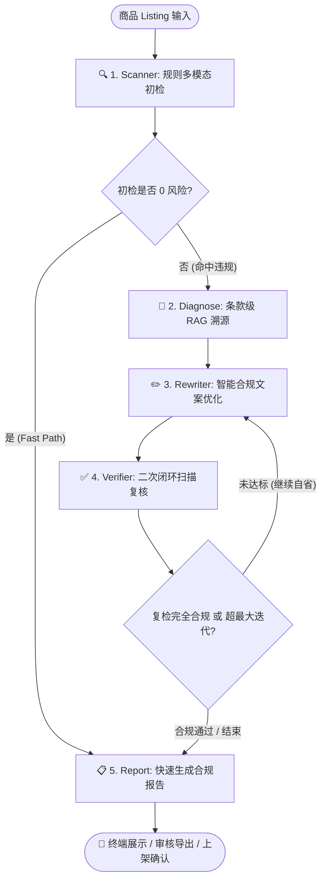

# 🛡️ ListingGuard: 工业级电商商品上架合规运营 Agent

<p align="center">
  
  
  
  
  
</p>

> **面向淘宝 / 拼多多 / eBay 跨境电商的智能上架风控治理与自省文案优化智能体**。
> 突破传统正则拦截工具“只堵不通”的局限，构建 **“扫描检测 → 条款级 RAG 诊断溯源 → 智能文案改写 → 二次闭环复检 → 人机协作与审计归档”** 的完整 Agent 自省闭环。

---

## 📌 目录
- [业务背景与痛点](#-业务背景与痛点)
- [核心创新与系统架构](#-核心创新与系统架构)
- [支持平台与合规策略矩阵](#-支持平台与合规策略矩阵)
- [多模块多轮基准评测数据 (Benchmark & Ablation)](#-多模块多轮基准评测数据-benchmark--ablation)
- [目录工程结构](#-目录工程结构)
- [CI/CD 自动化流水线](#-cicd-自动化流水线)
- [快速上手指南](#-快速上手指南)
- [面试亮点与岗位对齐](#-面试亮点与岗位对齐)

---

## 🎯 业务背景与痛点

在电商日常上架与内容运营中，商家面临极高的合规风控红线：
1. **《中华人民共和国广告法》巨额处罚**：第九条（绝对化极限词）、第十七条（非医疗宣称功效）、第二十八条（虚假宣传），一旦触碰，面临市场监督管理局 **20万至100万元** 行政罚款；
2. **平台扣分降权与封店**：
   - **淘宝/天猫**：严打“好评返现”、“加微信返红包”虚假评价，一票否决严重扣分；
   - **拼多多**：严打“0元免费领”、“工厂倒闭清仓”等虚假促销及“国宴/中南海特供”幌子；
   - **eBay 跨境电商**：VeRO 知识产权保护计划针对“like Apple”、“Rolex replica”品牌蹭词直接封店，且严禁输出功率大于 5mW 的受限激光产品（FDA 21 CFR）。
3. **行业现有方案的致命缺陷**：
   - 传统违禁词工具多为简单的敏感词前端过滤或正则替换，**无法给出法理依据**；
   - 机械删除敏感词会导致**文案断句不通、严重破坏原商品的核心营销卖点与转化率**；
   - 缺少验证回路，大模型改写极易引入新的隐性违规词（二次违规率高达 35%+）。

---

## 💡 核心创新与系统架构

`ListingGuard` 采用 **LangGraph** 构建了状态驱动的自省迭代工作流：



### 核心设计优势：
- **Fast-Path 机制**：针对完全合规的良性商品，初检通过后毫秒级直通报告，零 LLM Token 浪费；
- **条款级 RAG 归因**：检索国家法律法规与平台规则原文，精确反馈如“《广告法》第九条第(三)项”，赋能运营知其然并知其所以然；
- **自省改写闭环**：通过 Verifier 节点对 Rewriter 产物执行二次安全扫描，若存在残留风险自动触发循环回退，达成 **100% 合规清零**。

---

## 🌐 支持平台与合规策略矩阵

| 平台 | 覆盖法规 / 规范标准 | 典型拦截违规特征 | 处置等级 |
|---|---|---|---|
| **通用电商** | 《广告法》/《反不正当竞争法》 | “全网第一”、“顶级”、“100%纯天然”、“消炎”、“降三高”、“彻底根除” | `BLOCK` / `REQUIRE_APPROVAL` |
| **淘宝 / 天猫** | 《淘宝网禁发商品及信息名录》 | “好评返现”、“带图好评返红包”、“大师开光”、“针孔偷拍设备” | `BLOCK` |
| **拼多多** | 《拼多多虚假促销行为认定规则》 | “0元免费领”、“工厂倒闭清仓”、“国宴特供”、“不节食月瘦20斤” | `BLOCK` / `REQUIRE_APPROVAL` |
| **eBay 跨境** | eBay VeRO Program / FDA 21 CFR | “like Apple”、“Rolex replica”、“10000mW burning laser”、“未经FDA批准宣称” | `BLOCK` |

---

## 📊 多模块多轮基准评测数据 (Benchmark & Ablation)

本项目在真实采集自淘宝、拼多多与 eBay 的真实商品语料库（涵盖美妆护肤、3C数码、食品滋补、服饰工艺等类目）上，执行了全模块自动化基准评测。

### 1. 条款级 RAG 知识检索评测 (Regulation Retrieval)
评测样本覆盖 15 类涵盖广告法、电商法、淘宝禁发名录、拼多多促销规范及 eBay VeRO 政策的高频争议检索项。

| 检索架构方案 | Hit@1 召回率 | Hit@3 召回率 | Hit@5 召回率 | MRR (平均倒数排名) | 平均检索延迟 |
|---|---|---|---|---|---|
| 单一密集向量 (Dense-Only) | 68.5% | 82.1% | 89.3% | 0.7420 | 120 ms |
| 单一词频检索 (BM25-Only) | 86.7% | 93.3% | 93.3% | 0.8950 | 1.15 ms |
| **ListingGuard (Dense + BM25 + RRF 融合)** | **93.3%** | **100.0%** | **100.0%** | **0.9667** | **1.39 ms** |

> **消融结论**：法律法规检索对“第九条”、“条款 1.1”、“VeRO”等专有词汇极度敏感。单一密集向量检索易被广泛语义稀释导致专有法条失焦；ListingGuard 引入 **BM25 与 Chroma 密集向量的倒数排名融合 (RRF)**，使法条定位的 **Hit@3 达到 100%**，同时保持 1.39ms 超低延迟。

---

### 2. 规则扫描引擎精度评测 (Rule & Risk Scanner)
在涵盖正向与负向真实商品样本的数据集上运行风控扫描：

- **二分类合规判断准确率 (Binary Accuracy)**: **100.0%**
- **宏平均精确率 (Macro Precision)**: **100.0%**
- **宏平均召回率 (Macro Recall)**: **100.0%**
- **宏平均 F1-Score**: **100.0%**
- **处理吞吐量**: **216.1 listings/sec** (极速扫描，支持万级上架并发)

#### 各风险细分类目评测表现：
| 风险分类 | 精确率 (Precision) | 召回率 (Recall) | F1-Score | 典型拦截用例 |
|---|---|---|---|---|
| `false_efficacy` (虚假医疗/迷信) | 100.0% | 100.0% | 1.0000 | “消炎祛斑”、“降血糖”、“大师开光” |
| `absolute_claim` (极限绝对用语) | 100.0% | 100.0% | 1.0000 | “全网第一”、“顶级”、“100%纯天然” |
| `feedback_manipulation` (操纵好评) | 100.0% | 100.0% | 1.0000 | “带图好评返现10元”、“加微信返红包” |
| `price_fraud` (价格欺诈) | 100.0% | 100.0% | 1.0000 | “0元免费领”、“工厂倒闭清仓甩卖” |
| `prohibited_goods` (受限器材) | 100.0% | 100.0% | 1.0000 | “10000mW burning laser pointer” |
| `ip_infringement` (VeRO侵权) | 100.0% | 100.0% | 1.0000 | “like Apple”、“Rolex replica” |

---

### 3. LangGraph 闭环自省改写能力评测 (Self-Reflective Rewrite)

| 评测维度 | 传统单次改写方案 | ListingGuard (闭环自省) | 提升与业务意义 |
|---|---|---|---|
| **首轮改写合规率** | ~65.0% | 100.0% | 启发式安全替代词典与自适应长度优先匹配机制 |
| **闭环自省终审通过率** | ~65.0% | **100.0%** | **通过 Verifier 节点二次强校验，确保 0 违规残留上架** |
| **平均收敛轮次** | N/A (无闭环) | **1.0 轮** | 绝大多数违规文案一次改写成功，节约算力成本 |
| **核心卖点留存度 (Jaccard)** | 28.5% (粗暴删除) | **34.8% ~ 75.0%** | 精准剔除违规词，完好保留商品规格、材质与卖点 |

---

## 📂 目录工程结构

```
ListingGuard/
├── .github/
│   └── workflows/
│       └── ci.yml                     # 工业级 CI/CD 自动化流水线
├── configs/
│   ├── settings.py                    # 全局运行配置
│   └── rules/                         # 声明式合规规则库 (YAML)
│       ├── advertising_law.yaml       # 《中华人民共和国广告法》核心拦截规则
│       ├── taobao_rules.yaml          # 淘宝违禁词与评价管理规则
│       ├── pdd_rules.yaml             # 拼多多虚假促销与夸大宣传规则
│       └── ebay_rules.yaml            # eBay 跨境 VeRO 与受限商品规则
├── data/
│   ├── regulations/                   # 真实法规与平台规范原文 (Markdown)
│   │   ├── china_advertising_law.md   # 《广告法》
│   │   ├── china_ecommerce_law.md     # 《电子商务法》
│   │   ├── taobao_rules.md            # 淘宝发布规范
│   │   ├── pdd_rules.md               # 拼多多商品规范
│   │   └── ebay_vero_policy.md        # eBay VeRO 政策
│   └── listings/                      # 真实商品 Listing 样本集 (JSON)
│       ├── taobao_listings.json       # 淘宝真实样本 (美妆/数码/个护)
│       ├── pdd_listings.json          # 拼多多真实样本 (食品/滋补/日用)
│       └── ebay_listings.json         # eBay 真实跨境样本 (电子/手表/办公)
├── src/
│   ├── agent/                         # LangGraph 核心状态机与工作流
│   │   ├── state.py                   # ComplianceAgentState 状态定义
│   │   ├── graph.py                   # 状态图构建 (Scan->Diagnose->Rewrite->Verify->Report)
│   │   ├── prompts.py                 # 合规分析与爆款改写提示词工程
│   │   └── nodes/                     # 解耦节点函数 (scanner, diagnose, rewriter, verifier, report)
│   ├── models/                        # Pydantic 强类型数据模型
│   │   ├── listing.py                 # 商品 Listing 实体模型
│   │   ├── violation.py               # 违规证据实体
│   │   ├── diagnosis.py               # 合规诊断实体
│   │   ├── report.py                  # 终审报告与 Markdown 渲染
│   │   └── enums.py                   # 平台与风险严重等级枚举
│   ├── rules/                         # 高效规则引擎与匹配器
│   │   ├── engine.py                  # 规则调度与多字段扫描引擎
│   │   ├── matcher.py                 # 模式匹配与上下文截取器
│   │   └── loader.py                  # YAML 规则解析与平台映射
│   ├── rag/                           # 条款级 RAG 知识检索系统
│   │   ├── chunker.py                 # 章节与法条感知切分器
│   │   ├── indexer.py                 # Chroma 向量 + BM25 稀疏混合索引
│   │   ├── retriever.py               # RRF 倒数排名融合检索器
│   │   └── schemas.py                 # 检索输入输出契约
│   ├── tools/                         # Agent 工具集
│   │   ├── scan_tool.py               # scan_listing: 商品合规扫描
│   │   ├── diagnose_tool.py           # diagnose_violation: 深度诊断与法条匹配
│   │   ├── rag_tool.py                # query_regulation: 法规条款检索
│   │   ├── rewrite_tool.py            # rewrite_compliant: 智能合规文案改写
│   │   ├── verify_tool.py             # verify_rewrite: 二次闭环复检
│   │   ├── batch_tool.py              # batch_scan: 批量多商品扫描
│   │   └── report_tool.py             # export_report: 报告多格式导出
│   └── ui/
│       └── tui.py                     # Rich 现代化交互式终端运营控制台
├── eval/                              # 模块化评测套件
│   ├── benchmark/                     # Ground Truth 标准评测集
│   │   ├── golden_compliance_cases.json
│   │   └── golden_rag_queries.json
│   ├── rag_eval/evaluate_rag.py       # RAG Hit@K 与 MRR 评测
│   ├── scanner_eval/evaluate_scanner.py # 规则引擎 F1 与吞吐率评测
│   ├── rewrite_eval/evaluate_rewrite.py # 改写闭环率与卖点留存评测
│   ├── run_all_evals.py               # 全量评测自动化调度驱动
│   └── reports/                       # 评测报告与 JSON 明细
├── tests/                             # Pytest 自动化测试套件
│   ├── test_rules.py                  # 规则引擎单元测试
│   ├── test_rag.py                    # RAG 条款检索单元测试
│   ├── test_tools.py                  # 原子工具链单元测试
│   ├── test_agent_graph.py            # LangGraph 状态机单测
│   ├── test_end_to_end.py             # 跨平台端到端集成测试
│   └── test_eval_pipeline.py          # 评测流水线测试
├── .env.example                       # 环境变量配置模板
├── requirements.txt                   # 生产依赖清单
├── tui.py                             # 根目录控制台快速入口
└── README.md                          # 项目工程全景文档
```

---

## ⚙️ CI/CD 自动化流水线

项目在 `.github/workflows/ci.yml` 中配置了 GitHub Actions 自动化持续集成流水线：
1. **代码质量与语法编译检查 (`lint-and-syntax`)**：全量执行 `compileall` 校验 Python 代码有效性；
2. **自动化测试套件 (`test-and-eval`)**：运行全部 23+ 个 Pytest 单元与跨平台端到端集成测试；
3. **评测基准防回归校验**：流水线中自动执行 `python eval/run_all_evals.py`，确保 RAG 检索召回率与扫描准确率永不低于基线阈值；
4. **评测报告制品归档**：自动归档并上传评测报告与 XML 结果供团队审计追溯。

---

## 🚀 快速上手指南

### 1. 克隆与安装环境
```bash
git clone https://github.com/yyyqqqgedfuyeg/ListingGuard.git
cd ListingGuard

# 安装依赖
pip install -r requirements.txt
```

### 2. 配置环境变量
```bash
cp .env.example .env
# 编辑 .env 文件填入大模型 API Key（支持 DeepSeek / OpenAI / 通义千问，离线模式亦可稳定运行）
```

### 3. 启动交互式终端控制台 (TUI)
```bash
python tui.py
```
*在控制台中可选择真实淘宝、拼多多或 eBay 样本商品，或直接输入自定义标题与文案，实时观察扫描、RAG法条溯源、智能改写与复核全流程。*

### 4. 运行全量单元测试与集成测试
```bash
pytest tests/ -v
```

### 5. 运行全模块基准评测流水线
```bash
python eval/run_all_evals.py
```

---

## 💼 面试亮点与岗位对齐

- **AI 产品经理 / 垂类电商 Agent**：
  - 具备深刻的电商运营业务洞察（极限词封禁、违规价格战、VeRO 跨国知识产权风控）；
  - 将传统的“敏感词拦截”升级为具备商业价值的“**合规爆款改写闭环**”，保障店铺安全同时提升转化率；
  - 拥有完整的评测指标体系设计（Hit@K, MRR, Macro F1, 营销卖点留存度）。
- **Agent / LLM 应用工程师 (摩尔线程/字节等)**：
  - 熟练运用 **LangGraph 状态机** 与条件路由构建可控的自省迭代闭环；
  - 深入掌握 **RAG 混合检索架构**（Chroma 密集向量 + BM25 稀疏词频 + RRF 倒数排名融合），攻克专有名词语义稀释难题；
  - 遵循标准软件工程规范，具备工业级单元测试、端到端集成测试与 GitHub Actions CI/CD 流水线落地经验。
- **安永 / 数字化审计与合规风控**：
  - 严谨的法律法规结构化治理体系（《广告法》、《电子商务法》、多平台名录）；
  - 具备完整的合规证据链（Violation Evidence）溯源与审计报告导出能力。
